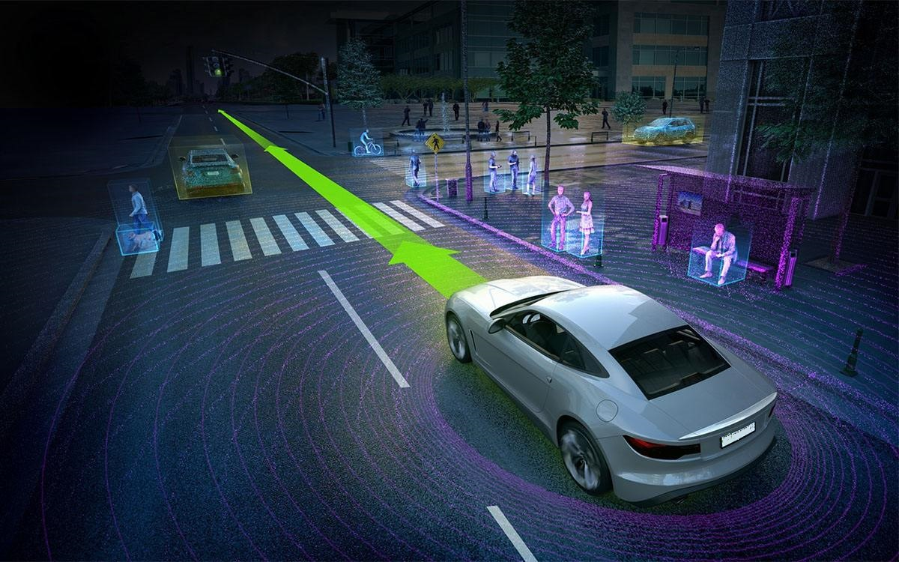

# Udacity_CarND

*Project on Self-Driving Car Engineer Nanodegree of Udacity*  

---

[Term 1 - Computer Vision and Deep Learning](https://github.com/WfHit/Udacity_CarND/tree/master/Term1)  
[Term 2 - Sensor Fusion, Localization and Control](https://github.com/WfHit/Udacity_CarND/tree/master/Term2)  
[Term 3 - Path planning, Concentrations and Systems](https://github.com/WfHit/Udacity_CarND/tree/master/Term3)  

---

  

---

Frank Wong  
__frankwinnovate@gmail.com__
