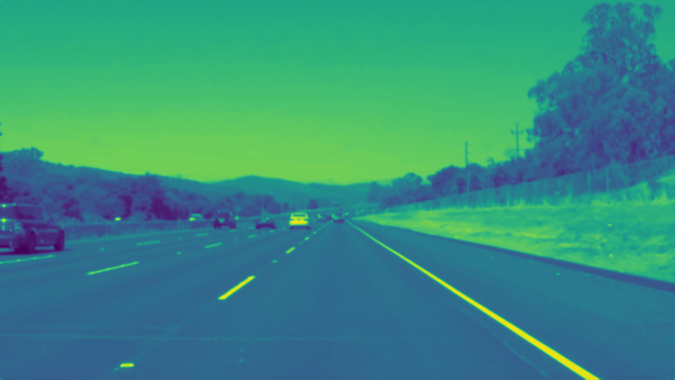

# **Finding Lane Lines on the Road** 

**The goals / steps of this project are the following:** 
* Make a pipeline that finds lane lines on the road 
* Reflect on work in a written report 

[//]: # (Image References)

[grayscale_image]: ./writeup_images/solidWhiteRight/solidWhiteRight_gray.jpg "Grayscale"
[blur_image]: ./writeup_images/solidWhiteRight/solidWhiteRight_blur.jpg "Gaussian smoothing"
[canny_image]: ./writeup_images/solidWhiteRight/solidWhiteRight_canny_edges.jpg "Canny Edge Detection"
[masked_image]: ./writeup_images/solidWhiteRight/solidWhiteRight_roi.jpg "Region of Interest"
[line_image]: ./writeup_images/solidWhiteRight/solidWhiteRight_line.jpg "Hough Transform"
[final_image]: ./test_images_output/solidWhiteRight.jpg "Final image"

---

## Reflection
### 1. Describe my pipeline. As part of the description, explain how I modified the draw_lines() function.
**My pipeline consisted of 6 steps:**  
1. I converted the images to grayscale.

  
2. I used Gaussian smoothing to reduce noise in the images.

  
3. I using the Canny image detection algorithm to find boundaries in the images.

  
4. I used a polyline to isolate the region of interest (trapezoid). I had to do some fine tuning to find a good compromise here.

  
5. I uses the Hough Trasform to identify the lines in the Region of Interest.

  
6. I stacked the image with lines on top of the original image.

  

**In order to draw a single line on the left and right lanes, I modified the draw_lines() function for doing the following:**
1. For each line calculates its slope 
2. According to the slope value, put the line piont to left line lsit or right line list
3. Using the value in the line list to fit a line
4. Calculate the up and down boundaries of line to draw
5. Draw the lines

### 2. Identify potential shortcomings with your current pipeline

When I testing my algorithm I find the following shortcomings: 
1. The slope of line is easily interfered by the small dashed lines; 
2. The result is easily disturbed by the color and shadows;
3. The algorithm is not suitable for curving road;

### 3. Suggest possible improvements to your pipeline

As to the throbbing slope, a possible improvement would be to smoothing the slope to archive a stable line. To increasing the contrast of the image in order to have better robustness agains shadows in the image. 
